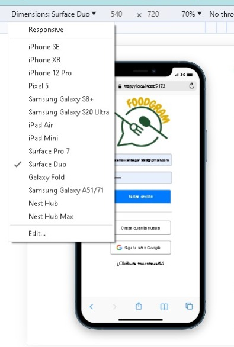

# ¡Foodgram!

## Índice

* [1. Introducción](#1-introducción)
* [2. Elaboracíon ](#2-elaboración)
* [3. Responsive](#3-responsive)
* [4. Testeos de usabilidad](#4-testeos-de-usabilidad)
* [5  Objetivos de aprendizaje](#5-objectivos-de-aprendizaje)
* [6. Checklist](#6-checklist)

## 1. Introducción

FoodGram es una red social destinada a los amantes de la gastronomía, donde pueden explorar excelentes recetas de diversas culturas y países. También proporciona la plataforma ideal para crear comunidades en las que los usuarios pueden compartir y expresar sus propias recetas.

## 2.  Elaboracíon

Lo primero que desarrollamos fue la planeacion y organización de nuetro proyecto con la aplicaccion trello y figma.

* [Figma](https://www.figma.com/file/iawVNzIQaWLuJljyZSeUmI/Untitled?type=whiteboard&node-id=0-1&t=TPoyRuF9BnGewazI-0): En esta aplicación encontrara toda la documentación generada en cada etapa del proceso como:

* Enuesta de viabilidad.
* Diagrama de Flujo.
* Historias de Usuarios.
* Prototipo de Baja y Alta fidelidad.
 
## 3. Responsive

Esto garantiza que la experiencia del usuario sea óptima, ya sea que estén navegando en una computadora de escritorio, una tableta o un teléfono móvil. Un diseño web o una aplicación "responsive" se ajusta automáticamente para mostrar y organizar el contenido de manera legible y funcional en cualquier dispositivo, lo que mejora la accesibilidad y la usabilidad, y evita que los usuarios tengan que hacer zoom o desplazarse excesivamente para ver o interactuar con la información.

## 4.  Testeos de usabilidad

Son evaluaciones sistemáticas que se realizan en productos, como sitios web, aplicaciones móviles o productos físicos, para medir la facilidad con la que los usuarios pueden interactuar con ellos. Estos test se llevan a cabo con usuarios reales o representativos del público objetivo.

El objetivo principal de los testeos de usabilidad es identificar problemas en la experiencia del usuario, como dificultades de navegación, diseño confuso o funciones poco intuitivas. Estos test suelen incluir tareas específicas que los usuarios deben realizar mientras se registran sus interacciones y comentarios.

## 5. Objetivos de aprendizaje

* Permite crear posts.
* Permite editar y eliminar posts.
* Permite definir la privacidad de los _posts_.
* Permite ver su muro de cualquier usuario "no-amigo" (solamente los
  posts _públicos_).
* Permite darle link a los post.

## 6. Checklist
 * Pasa tests (npm test)
 * Pruebas unitarias cubren el 100% de statements, functions y lines y branches.
 * Incluye Definición del producto clara e informativa en README.md.
 * Incluye historias de usuario en README.md.
 * Incluye sketch de la solución (prototipo de baja fidelidad) en README.md.
 * Incluye Diseño de la Interfaz de Usuario (prototipo de alta fidelidad) en README.md.
  * Incluye el listado de problemas que detectaste a través de tests de usabilidad en el README.md.
